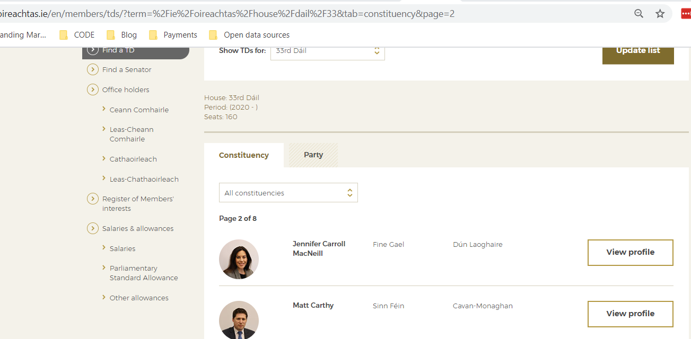

```{r setup, include=FALSE}
knitr::opts_chunk$set(echo = TRUE)
knitr::opts_chunk$set(fig.path='{{ site.url }}/images/scrape-irish-parliament-')
library(knitr)
```

## How do you scrape data with R?

I'll walk you through the method that I'm familiar with, using the *rvest* package.

First, I'll use *pacman* to install some packages that we'll need.

```{r libraries, eval = FALSE}
install.packages("pacman")

pacman::p_load(rvest, dplyr, stringr, tidyr)
```


```{r deputies, echo = FALSE}

```

In this specific example, there are several elements that I want to extract from each webpage, so I'll download the pages in their entirety before extracing what I need and storing it in a dataframe.

```{r cars}
summary(cars)
```

## Including Plots

You can also embed plots, for example:

```{r pressure, echo=FALSE}
plot(pressure)
```

```{r cars_plot, echo=FALSE}
plot(cars$speed)
```

Note that the `echo = FALSE` parameter was added to the code chunk to prevent printing of the R code that generated the plot.
